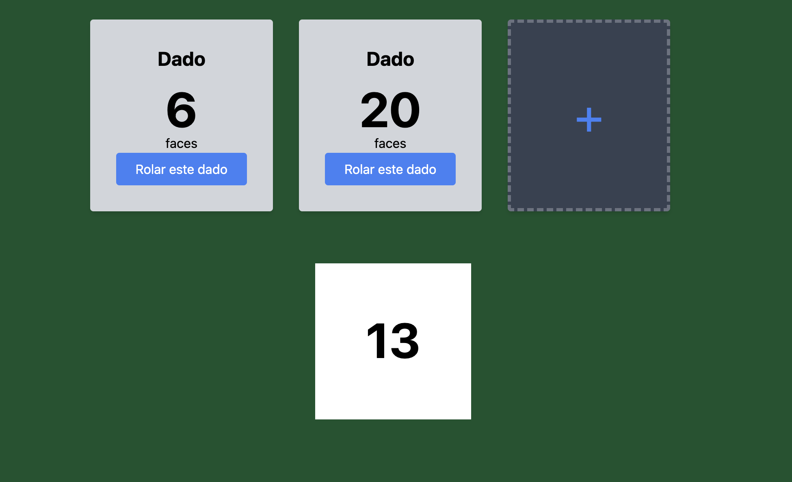
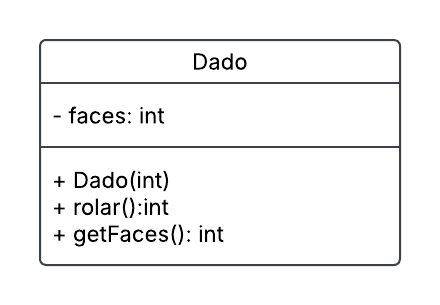

# Projeto Dado Easy

Este é um projeto de exemplo da disciplina de Programação Orientada a Objetos (POO) do SENAC. Neste projeto, são tratados os conceitos de classe, objeto, atributos, métodos e encapsulamento.

## Objetivo

O objetivo deste projeto é que o aluno complete a implementação criando a classe `Dado` com o atributo `faces` e o método `rolar`, além dos métodos de acesso (getters e setters) e construtores.

## Estrutura do Projeto

- **Classe `Dado`**: Representa um dado com um número variável de faces.
    - **Atributo `faces`**: Indica o número de faces do dado.
    - **Método `rolar`**: Simula o lançamento do dado, retornando um valor aleatório entre 1 e o número de faces.
    - **Métodos de acesso**: Getters e setters para o atributo `faces`.
    - **Construtores**: Construtores para inicializar o dado com um número específico de faces.

O diagrama de classes abaixo ilustra a estrutura do projeto:



## Como Rodar o Projeto Spring

Para rodar o projeto Spring, siga os passos abaixo:

1. **Clone o repositório**:
     ```bash
     git clone <URL_DO_REPOSITORIO>
     cd <NOME_DO_DIRETORIO>
     ```

2. **Compile o projeto**:
     ```bash
     ./mvnw clean install
     ```

3. **Execute a aplicação**:
     ```bash
     ./mvnw spring-boot:run
     ```

4. **Acesse a aplicação**:
     Abra o navegador e acesse `http://localhost:8080`.

## Conclusão

Este projeto serve como uma base para a prática dos conceitos de POO. Complete a implementação da classe `Dado` e explore os conceitos aprendidos durante a disciplina.
